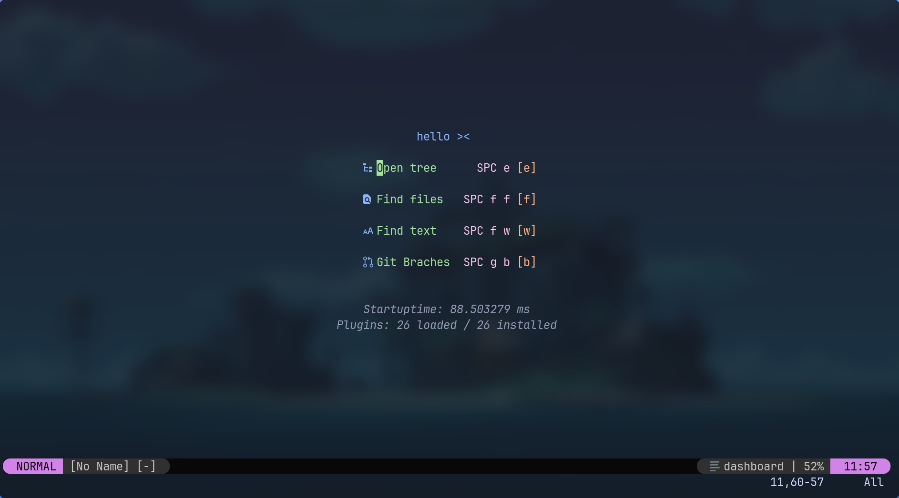

# My Neovim Configuration  

A minimal yet powerful Neovim setup tailored for productivity.  

## Features  
- Fast startup with lazy-loaded plugins  
- Custom keybindings for efficient navigation  
- Language server support (LSP)  

## Quickstart with my config:  
```sh
cd ~/.config/ && git clone https://github.com/jdunCode/nvim
```
Then open Neovim and let it install the plugins automatically.
